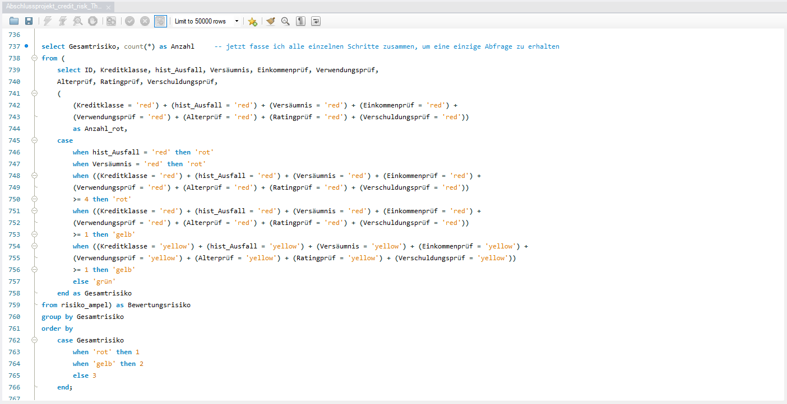

# 🏦 Credit Risk Analysis – Kreditrisikobewertung mit SQL (MySQL Workbench)

## 💻 Code-Beispiel (MySQL Workbench)

  

## 📊 Ergebnisübersicht

  

---

## 🧾 Projektübersicht

| Kategorie | Details |
|------------|----------|
| 🧠 **Thema** | Kreditrisikobewertung & Risiko-Ampelsystem mit SQL |
| 🧰 **Tools** | MySQL Workbench, SQL (Views, Aggregationen, Case-Statements) |
| 📊 **Datengrundlage** | Credit Risk Dataset mit 32.581 Kreditfällen |
| ⏱️ **Zeitraum** | Oktober 2025 |
| 🎯 **Ziel** | Entwicklung eines datenbasierten Risikobewertungssystems zur Identifikation von Hochrisiko-Kreditnehmern |
| 💡 **Schwierigkeitsgrad** | Fortgeschritten – Fokus auf Datenbereinigung, Analysen & Risiko-Klassifizierung |

---

## 🎯 Projektziel
Ziel des Projekts war die Entwicklung eines **Risiko-Ampelsystems** zur systematischen Bewertung von Kreditrisiken.  
Durch SQL-basierte Analysen wurden Hochrisiko-Profile identifiziert und Handlungsempfehlungen für das Kreditmanagement abgeleitet.

---

## 🧩 Aufgabenstellung
Analysiere einen Datensatz mit über 32.000 Kreditfällen, um:
- Risikofaktoren und Ausfallmuster zu identifizieren,  
- ein mehrstufiges **Ampelsystem** (grün/gelb/rot) zur Risikobewertung zu entwickeln,  
- Empfehlungen zur Minimierung von Kreditausfällen zu erarbeiten.

---

## 🧮 Datengrundlage
- **Quelle:** Credit Risk Dataset mit 32.581 Datensätzen  
- **Struktur:** Kreditnehmerdaten (Alter, Einkommen, Beschäftigungsdauer), Kreditdetails (Betrag, Zinssatz, Rating), Ausfallhistorie  
- **Tools:** MySQL Workbench (Views, Aggregationen, Case-Statements, Subqueries)

---

## 🔍 Analyseschritte

### 1️⃣ **Datenbereinigung & Vorbereitung**
- Identifikation und Bereinigung fehlender Werte in `loan_int_rate`  
- Berechnung kategoriespezifischer Durchschnittswerte für jede `loan_grade` (A–G)  
- Korrektur von Ausreißern (z. B. 123 Jahre Betriebszugehörigkeit bei 21-Jährigen)  
- Erstellung von **Altersgruppen** (20-24, 25-34, 35-44, 45-54, 55+)

### 2️⃣ **Explorative Datenanalyse**
- Analyse von **Kreditvolumen nach Altersgruppen** → 20-24-Jährige erhalten unverhältnismäßig hohe Kredite  
- Identifikation **säumiger Kunden**: 7.108 Zahlungsausfälle (21,8 % Säumigkeitsrate)  
- Untersuchung der **Säumigkeitsrate nach Altersgruppen** → Höchste Rate bei 55+  
- Analyse von **Einkommensmustern** → Auffällig hohe Einkommen bei 20-24-Jährigen (Verdacht auf gefälschte Angaben)

### 3️⃣ **Risikobewertung nach Kriterien**
Das Ampelsystem bewertet Kredite nach **8 Risikofaktoren**:

| Kriterium | Grün | Gelb | Rot |
|-----------|------|------|-----|
| **Historischer Ausfall** | Kein Ausfall | - | Ausfall vorhanden |
| **Aktuelles Versäumnis** | Keine Säumnis | Säumig | - |
| **Einkommen** | > 60.000 € | 20.000–60.000 € | < 20.000 € |
| **Kreditverwendung** | Education, Venture | Debt Consolidation, Home Improvement, Medical | - |
| **Alter** | 20-44 Jahre | 45-54 Jahre | 55+ Jahre |
| **Kreditrating** | A, B | C | D–G |
| **Verschuldungsgrad** | < 10 % | 10-29 % | ≥ 30 % |

### 4️⃣ **Gesamtrisiko-Klassifizierung**
Logik für das **Gesamtrisiko**:
- **ROT** → wenn historischer Ausfall ODER aktuelles Versäumnis ODER ≥ 4 rote Kriterien  
- **GELB** → wenn ≥ 1 rotes Kriterium ODER ≥ 1 gelbes Kriterium  
- **GRÜN** → alle Kriterien grün

**Ergebnis:**  
- **18.234** Kredite → **ROT** (56 %)  
- **10.487** Kredite → **GELB** (32 %)  
- **3.860** Kredite → **GRÜN** (12 %)

---

## 📈 Ergebnisse & Insights

### 🔴 **Hochrisiko-Segmente**
- **Altersgruppe 20-24:** Höchstes Kreditvolumen, aber geringe Bonität (niedriges Einkommen, geringe Beschäftigungsdauer)  
- **Kreditklasse D-G:** 42 % aller Kredite fallen in schlechtere Ratings → Hohe Ausfallwahrscheinlichkeit  
- **Verwendungszweck "Debt Consolidation":** Erhöhte Säumigkeitsrate von 28,3 %

### 🟡 **Kritische Faktoren**
- **Beschäftigungsdauer < 1 Jahr:** Ausfallquote von 24,7 %  
- **Verschuldungsgrad > 30 %:** Stark erhöhtes Risiko  
- **Einkommen < 20.000 €:** 2.860 säumige Kunden in der Altersgruppe 20-24

### 🟢 **Empfehlungen**
1. **Verschärfte Prüfung** für Altersgruppe 20-24 und Kreditklassen D-G  
2. **Einkommensprüfung** bei jungen Kreditnehmern (Verdacht auf gefälschte Angaben)  
3. **Ablehnung** von Krediten mit ≥ 4 roten Kriterien  
4. **Monitoring** für gelbe Kredite mit regelmäßiger Überprüfung

---

## 🧠 Learnings
- Aufbau komplexer **SQL-Views** für mehrstufige Risikobewertungen  
- Anwendung von **CASE-Statements** für Kategorisierung und Ampel-Logik  
- Umgang mit fehlenden Daten und Ausreißern  
- Entwicklung eines praxisnahen **Scoring-Systems** für Kreditentscheidungen

---

## 📁 Projektdateien
| Datei | Beschreibung |
|--------|---------------|
| `Abschlussprojekt_credit_risk_Thorsten_Teetzen.sql` | SQL-Code mit Analysen und Risiko-Ampel |
| `Abschlussprojekt_credit_risk_Thorsten_Teetzen.pptx` | Präsentation der Ergebnisse |

---

## 👤 Autor

**Thorsten Teetzen**  
*Data Analyst (IHK-Zertifizierung in Ausbildung)*  

📅 **Projektzeitraum:** Oktober 2025  
🌍 **Standorte:** Germany / Asia (Remote)  
🔗 [LinkedIn-Profil](https://www.linkedin.com/in/thorsten-teetzen-744891350)

---

## 📄 Lizenz
Dieses Projekt steht unter der **MIT-Lizenz** – siehe [LICENSE](LICENSE) Datei für Details.  
Es wurde im Rahmen der Weiterbildung zum **Data Analyst (IHK)** zu Lern- und Demonstrationszwecken erstellt.  
Eine kommerzielle Nutzung oder Weitergabe der enthaltenen Daten ist ausgeschlossen.  

© 2025 Thorsten Teetzen